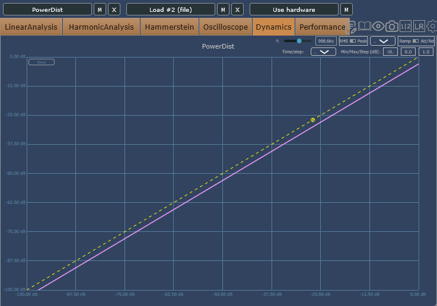
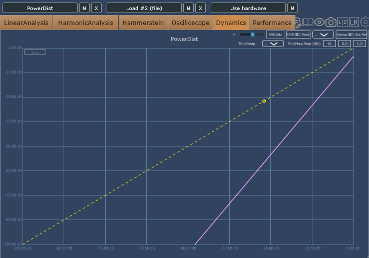

# PowerDist - Exponentiation Waveshaper Audio Plugin


## Overview

Prototype distortion plugin that applies wave-shaping via exponentiation.
The core formula is a simple $buffer^n$ transform, with parameters controlling the amount of distortion.
Uses 4x oversampling and a LUT-based wave-shaping path.

## Features

- Distortion generated by exponentiating the waveform
- 4x oversampling
- LUT-based wave-shaping
- Built as a JUCE-based plugin

## Prerequisites

- JUCE (including Projucer)
- Visual Studio for Windows (uses Builds/VisualStudio2026)
- C++17 or later

  ## License

This project is open-source and available under the [MIT License](LICENSE).

> [!NOTE]
> The JUCE library code used in this project is licensed under AGPLv3. 
> While my original code is provided under the MIT License, please be aware that many parts of it depend on the JUCE framework.

## Build (Windows)

1. Open PowerDist.jucer in Projucer
2. Verify the JUCE path settings and save
3. Open Builds/VisualStudio2026/PowerDist.sln
4. Choose a build configuration and build

## Directory Layout

```
Source/
  PluginProcessor.cpp
  PluginEditor.cpp
  DSP/
    PowerDistProcessor.cpp
  Parameters/
```

## Implementation Notes

- DSP logic is centralized in Source/DSP/PowerDistProcessor.cpp
- LUT generation/use and 4x oversampling are handled in the DSP layer
- Parameter definitions live under Source/Parameters

## Measurement Results

<table>
  <tr>
    <td></td>
    <td></td>
  </tr>
  <tr>
    <td align="center">n = 1.0</td>
    <td align="center">n = 2.0</td>
  </tr>
</table>

With RMS set to 2.0, the curve becomes noticeably steeper at n = 1.0 and 2.0.
Once the signal crosses a certain level, loudness rises quickly, which feels closer to a gate or fuzz style response.
This behavior suggests it can also be used as a transient shaper to emphasize attack.

## Related Resources

- [JUCE Official Documentation](https://docs.juce.com/)
- [JUCE Download](https://juce.com/)

---
